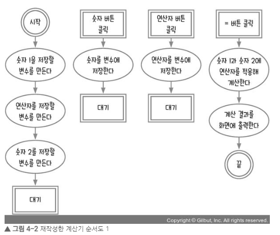
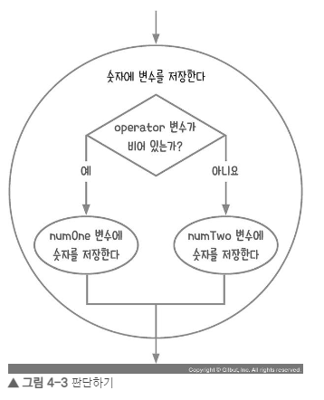
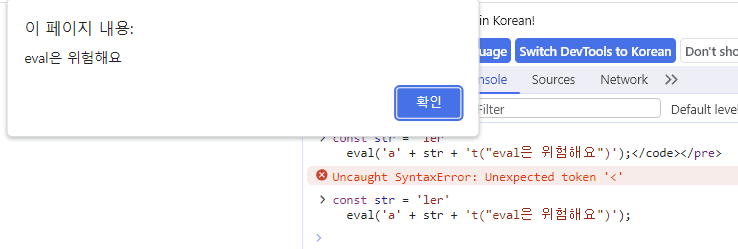

# 2주차

학습 자료 : Let's Get It 자바스크립트 프로그래밍 [ 저자 : 조현영 ]

[강의링크] : https://www.youtube.com/watch?v=2yGhb-z8VTQ&list=PLcqDmjxt30RvEEN6eUCcSrrH-hKjCT4wt

## 4장 : 계산기

### 순서도 그리기

  
자바스크립트의 순서도를 만들 때 사용자의 이벤트를 기주으로 순서도를 끊어야 한다. 
계산기는 사용자가 숫자나 연산자 (더하기, 빼기, 나누기, 곱하기 등 ) 버튼을 클릭해 여러 가지 계산을 하는 장치이므로, 
클릭 이벤트를 고려하여 순서도를 작성하여야 한다.

 

이후 연산자와 피연산자를 저장할 변수를 설정하고, 어떻게 계산할지 생각한다.

 

### 고차 함수 사용하기

- 함수를 호출할 때마다 반환 함수를 생성하는 함수를 고차함수(high order function) 이라고 한다.
  <pre><code>const func = () => {
    return () => {
      console.log('hell');
    };
  }; </code></pre>

- 반환된 함수는 다른 변수에 저장할 수 있고, 그 변수에 저장된 함수를 다시 호출할 수 있다.
  <pre><code>const innerFunc = func();
  innerFunc(); // hello </code></pre>

- 반환하는 값을 바꾸고 싶을 때는 매개변수를 사용한다.
  <pre><code>const func = (msg) => {
    return () => {
      console.log(msg);
    };
  };</code></pre>

- 화살표 함수 문법에 따라 함수의 본문에서 바로 반환되는 값이 존재하면 { } 와 return 을 생략할 수 있다.
  <pre><code>const func = (msg) => () => {
    console.log(msg);
  };</code></pre>

 

### eval 사용하기

- 일반적으로 문자열을 연산자로 바꿀 수 없지만, 문자열을 자바스크립트 코드처럼 실행하는 방법이 있다.

  <pre><code>eval('1+2'); // 3</code></pre>

- 예를 들어 numOne이 5, op가 -, numTwo가 2인 경우
  <pre><code>eval(numOne + op + numTwo); // '5-2'인 문자열 => 3 반환</code></pre>

  코드가 간단해져 편리하지만 eval 함수를 남용하면 해커의 악용 가능성이 존재한다. 
  eval 함수에 문자열을 입력하면 그대로 실행될 수 있기 때문이다.

- 다음과 같은 코드를 실행할 경우 alert 창이 실행된다.
  <pre><code>const str = 'ler'
  eval('a' + str + 't("eval은 위험해요")');</code></pre>

  
