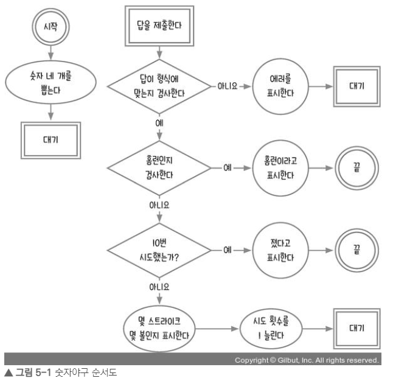

# 3주차

학습 자료 : Let's Get It 자바스크립트 프로그래밍 [ 저자 : 조현영 ]

[강의링크] : https://www.youtube.com/watch?v=2yGhb-z8VTQ&list=PLcqDmjxt30RvEEN6eUCcSrrH-hKjCT4wt

## 5장 : 숫자야구

### 순서도 그리기

  
자바스크립트의 순서도를 만들 때 사용자의 이벤트를 기주으로 순서도를 끊어야 한다. 
계산기는 사용자가 숫자나 연산자 (더하기, 빼기, 나누기, 곱하기 등 ) 버튼을 클릭해 여러 가지 계산을 하는 장치이므로, 
클릭 이벤트를 고려하여 순서도를 작성하여야 한다.

 

이후 연산자와 피연산자를 저장할 변수를 설정하고, 어떻게 계산할지 생각한다.

 
