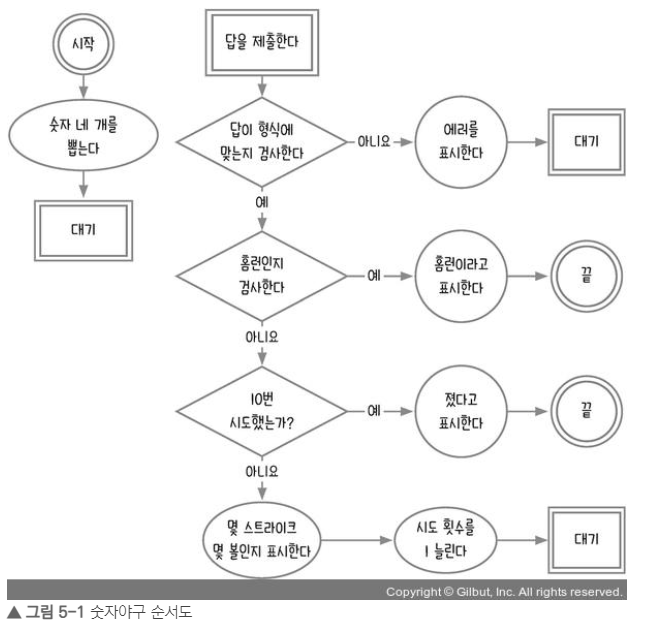

# 3주차

학습 자료 : Let's Get It 자바스크립트 프로그래밍 [ 저자 : 조현영 ]

[강의링크] : https://www.youtube.com/watch?v=2yGhb-z8VTQ&list=PLcqDmjxt30RvEEN6eUCcSrrH-hKjCT4wt

## 5장 : 숫자야구

### 순서도 그리기

 

### 무작위로 숫자 뽑기

무작위로 숫자를 뽑을 때는 Math.random 메소드를 사용한다.  
단, 뽑은 값은 정수가 아니므로 다음과 같은 메소드를 사용해서 정수로 바꾸어 주어야 한다.

- **Math.floor** : 내림
- **Math.ceil** : 올림
- **Math.round** : 반올림

 

### 1부터원하는 수까지 배열 만들기

<pre><code>const numbers =[];
for (let n =1; n<=9; n++){
  numbers.push(n);
}</code></pre>

위 코드를 다음과 같이 배열의 메소드만으로 같은 결과를 얻을 수 있다.

 

<pre><code>const numbers = Array(9).fill().map((v, i) => i + 1)</code></pre>

- **fill()** : 배열의 요소에 undefinded 채워 넣기
- **map** : 요소들을 일대일로 짝지어서 다른 값으로 변환

 

### indexOf와 includes

**indexOf**와 **includes**는 배열이나 문자열에 원하는 값이 들어 있는지 찾는 메소드 이다.  
원하는 값이 들어 있다면 해당 인덱스를 알려주고, 들어 있지 않다면 -1을 반환한다. **includes**는 조금 더 직관적으로 **true/false**를 반환한다.

<pre><code>'2345'.indexOf(3) === 1;
'2345'.indexOf(5) === 3;
['2', '3', '4', '5'].indexOf('5') === 3;
['2', '3', '4', '5'].indexO(5) === -1; // 요소의 자료형까지 같아야 함
'2345'.include(3) === true;
['2', '3', '4', '5'].include(5) === false;
</code></pre>

 

### forEach와 map

forEach는 반복문 효과를 내는 배열의 메소드이다.  
인수로 함수를 넣고, 이 함수가 각각의 배열 요소들에 순서대로 적용된다.

<pre><code>const array = [1, 3, 5, 7];
array.forEach((value, index) => {
  console.log(value, index);
})
</code></pre>

map도 반복문 역할을 하지만, 반환값이 있다는 점에서 forEach와 다르다.  
map은 기존 배열의 요소를 일대일로 다른 값으로 바꿉니다.  
단, 기존 배열의 값이 바뀌는 것이 아니라 새로운 배열을 만든다.

 

<pre><code>const array = [1, 3, 6, 5];
const newArray = array.map((value, index) => {
  return value +1;
});
console.log(newArray); // [2, 4, 7, 6]
</code></pre>

이렇게 map과 배열을 사용해서 긴 반복문을 짧게 줄일 수 있다.

 

### document.createElement / document.create TextNode

각각의 태그와 텍스트를 만드는 메서드이다.  
단, 다른 태그에 append나 appendChild 하기 전까지는 화면에 보이지 않는다.

기존 $log 태그의 내용을 유지하면서 추가로 다음 줄에 기록을 남기려면 document.createTextNode로 먼저 텍스트를 만들고 ,  
appendChild 로 화면에 추가해야 한다. textContent를 사용할 경우 기존 내용이 사라진다.

일반적으로 **document.createElement**은 새로운 요소를 만들 때 사용되고,  
**document.createTextNode**는 요소 내의 텍스트를 조작하거나 변경할 때 사용됩니다.

 

### form 태그

form 태그는 입력 필드와 제출 버튼 등의 컨트롤 요소를 감싸는 역할을 한다.  
input 태그를 쓰면 보통 form으로 감싸준다(웹 표준 형식). 이럴땐 form에 이벤트를 달아준다.  
form은 새로고침(기본동작) 되기 때문에 새로고침시 변수에 저장된 값이 날라간다  
=> **event.preventDefault();** // 기본 동작 막기

 

### join 메소드

join() 메서드는 JavaScript 배열의 모든 요소를 문자열로 결합하여 하나의 문자열로 반환하는 메서드이다.  
배열 요소 간의 구분자(separator)를 지정할 수 있으며, 구분자를 사용하여 배열 요소를 이어붙이는 역할을 한다.  
join() 메서드는 **배열을 문자열로 변환할 때 주로 사용됩니다.**

<pre><code> const ary = [3, 1, 4, 6];
const newAry = ary.join('');
console.log(newAry); // '3146'
</code></pre>

 

### appendChild와 append

document.createElement, document.createTextNode로 만든 태그나 텍스트를 선택한 태그의 자식 태그로 넣는다.  
appendChild로는 하나만 넣을 수 있고, append를 사용하면 여러 개를 동시에 넣을 수 있습니다.  
또한, append로 텍스트를 추가할 때는 document.createTextNode 대신 문자열을 바로 넣어도 된다.

 
