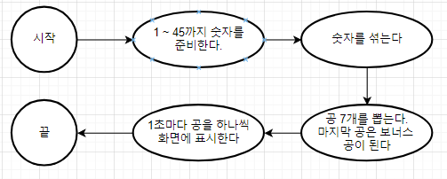
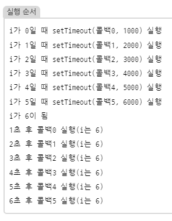

# 4주차

학습 자료 : Let's Get It 자바스크립트 프로그래밍 [ 저자 : 조현영 ]

[강의링크] : https://www.youtube.com/watch?v=2yGhb-z8VTQ&list=PLcqDmjxt30RvEEN6eUCcSrrH-hKjCT4wt

## 6장 : 로또 추첨기

### 순서도 그리기

 

### sort 정렬하기

비교 함수에 적힌 내용대로 배열을 정렬한다

<pre><code>배열.sort(비교 함수);</code></pre>

반환값이 0보다 크면 b, a 순으로 정렬되고, 0보다 작으면 a, b 순으로 정렬된다.

<pre><code>let ary = [13, 2, 46, 22, 100]   
ary.sort((a,b) => a - b); // 오름차순
ary.sort((a,b) => b - a); // 내림차순 
</code></pre>

 

### setTimeout

지정한 시간(밀리초) 뒤에 지정한 작업을 수행하는 타이머

<pre><code>setTimeout(() => {
  // 내용
}, 밀리초)
</code></pre>

 

### 클로저란 ?

함수 안에 함수를 선언한 환경(함수의 바깥)에서의 관계를 의미한다.  
함수 스코프를 가진 var과 비동기 함수인 setTimeout이 만나면 클로저 문제가 발생한다.  
즉, 함수 내부에서 외부 변수에 접근하는 경우에 발생하는 문제이다.

<pre><code>for (var i = 0; i < winBalls.length; i++) {
  setTimeout(() => {
    drawBall(suffle[i], $result);
  }, (i + 1) * 1000);
}
</code></pre>

setTimeout 함수는 비동기적으로 실행되며 i 변수는 반복문의 종료까지 증가한다.  
이때 setTimeout의 콜백 함수가 실행될때, i값이 0 ~ winBalls.length으로 계산되는 것이 아니라 i의 최댓값으로 고정된다.

 

 

### let과 var의 차이점

var은 더 이상 쓸 필요가 없다. 단, 개념은 알고 있어야 한다.
변수는 스코프(범위)라는 것을 가진다.  
var는 함수 스코프, let은 블록 스코프를 가진다.

- 함수 스코프 : **함수**를 경계로 접근 여부가 달라진다
- 블록 스코프 : **블록**을 경계로 접근 여부가 달라진다.

<pre><code>A = () => {
    var a = 1;
} 
console.log(a); // undefinded
</code></pre>

<pre><code>if(true){
  var b = 1;
}
console.log(b); // 1
</code></pre>

<pre><code>for (let i = 0; i<5; i++){}
console.log(i); // undefined
</code></pre>

<pre><code>for (var i = 0; i<5; i++){}
console.log(i); // 5
</code></pre>
